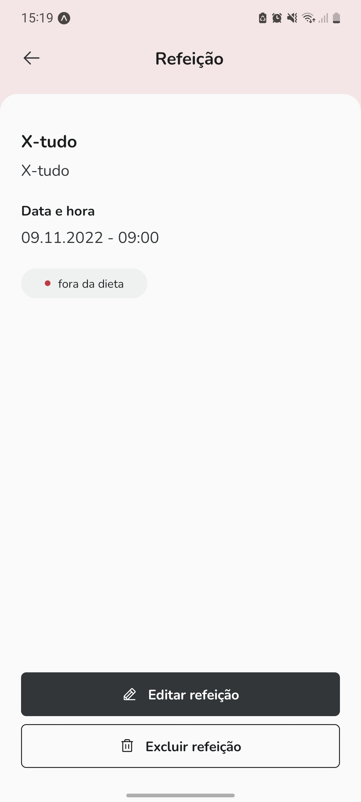

# Daily Diet - Ignite | Rocketseat

## Português

#### Aplicativo de registro de refeições

A aplicação foi desenvolvida em React Native com Expo e Styled-components utilizando o design disponibilizado através do Figma. Nela o usuário pode cadastrar refeições que podem estar dentro ou fora da dieta, bem como acompanhar as estatísticas baseadas nos registros, editar e excluir refeições. Os dados persistem na memória do dispositivo.

## English

#### Meal registration app

The application was developed in React Native with Expo and Styled-components using the design made available through Figma. In it the user can register meals that can be on or off the diet, as well as track statistics based on records, edit and delete meals. The data persists in the device's memory

## Screenshots

    

        
        
        
        
        
        
    

## Video

https://user-images.githubusercontent.com/86618257/200913035-fadc6d8e-c0ca-4f0e-880b-85dc9902592c.mp4

## Stack

 
